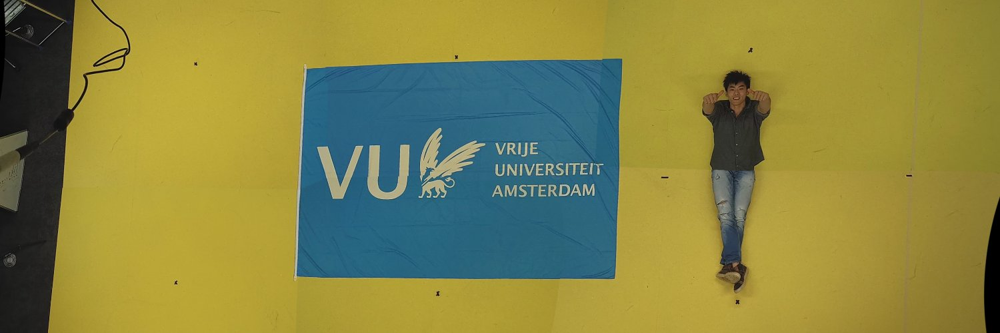

**Projects**
-
---
_Multi-stitch-stream_, repository for merging of multiple camera streams\\
{:target="_blank"}

**Papers**
-
---
_Environment induced emergence of collective behaviour in evolving swarms with limited sensing_ [doi: 10.1145/3512290.3528735](https://doi.org/10.1145/3512290.3528735){:target="_blank"}\\
{:target="_blank"}

_The Influence of Robot Traits and Evolutionary Dynamics on the Reality Gap_ [doi: 10.1109/TCDS.2021.3112236](https://doi.org/10.1109/TCDS.2021.3112236){:target="_blank"}\\
{:target="_blank"}

_Learning directed locomotion with Internal Model Control_ [doi: 10.1109/SSCI47803.2020.9308557](https://doi.org/10.1109/SSCI47803.2020.9308557){:target="_blank"}\\
{:target="_blank"}
